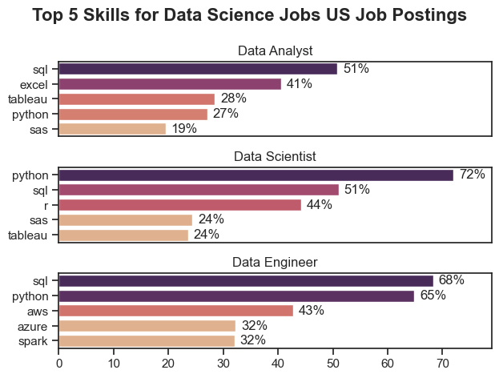
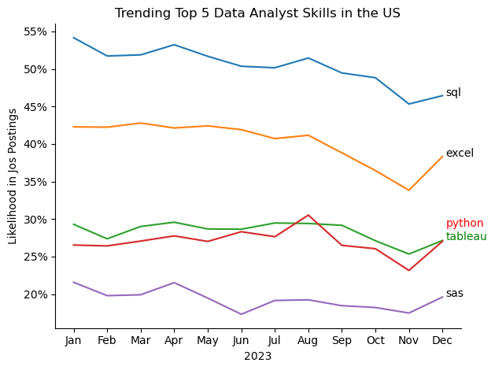
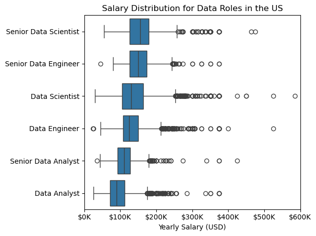
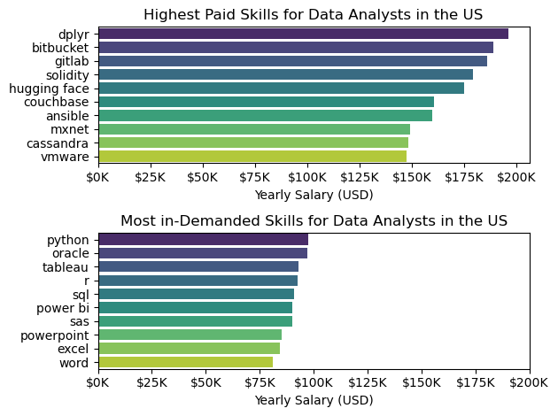
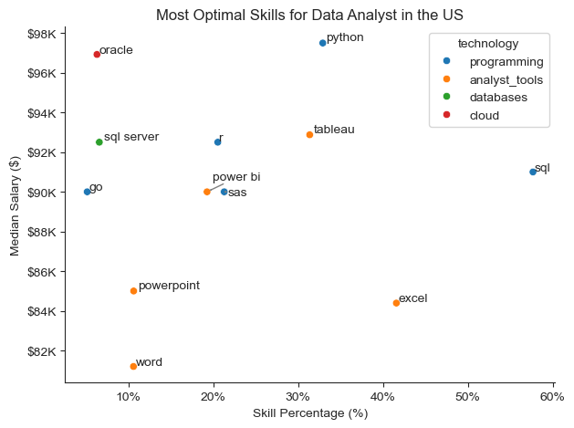

# The Analysis

### 1. What are the most demanded skills for the top 3 most popular Data Jobs?
to find the most demanded skills for the top 3 popular data roles, i first filtered out those positions by which ones were the most popular, and then i got the top 5 skills for each one of the top 3 roles, this query highlights the most popular job titles in data roles with thier associated top skills, showing which skills to pay attention to depending on the role i'm prefering more

 View my notebook with detailed steps here:
 [2_Skills_Count.ipynb](2_Skills_Count.ipynb)

### Visualize Data

```python
fig, ax = plt.subplots(len(top_3_jobs), 1)

for i, job_title in enumerate(top_3_jobs):
    csv_plot = csv_skills_perc[csv_skills_perc['job_title_short'] == job_title].head(5)
    sns.barplot(
        data=csv_plot,
        x='skills_percentage',
        y='job_skills',
        ax=ax[i],
        hue='skills_percentage',
        palette='flare',
        legend=False,
    )
```

### Results


### Insights

- Python is highly sought after in Data Science and Data Engineering roles, appearing in 72% of Data Science job postings and 65% of Data Engineering job postings.
- sql is highly requested in both Data Analyst and Data Engineering roles with over half of job postings.
- Data Engineering require more  specialized technical skills (aws, azure, spark) unlike Data Analyst and Data Science roles who are requiering more general data analyst and management rools such as Excel and Tableau.

## 2. How are in-demand skills trending for Data Analyst in the US?

### Visualize Data

```python
csv_plot = csv_DA_perc.copy()
ax = sns.lineplot(data=csv_plot, dashes=False, palette='tab10')
ax.yaxis.set_major_formatter(FuncFormatter(lambda x, _: f'{int(x)}%'))
plt.title('Trending Top 5 Data Analyst Skills in the US')
plt.xlabel('2023')
plt.ylabel('Likelihood in Jos Postings')
sns.despine()
plt.legend().remove()

for i in range(5):
    if i == 2:
        plt.text(11.1, csv_plot.iloc[-1, i], csv_plot.columns[i], color='green')
    elif i == 3:
         plt.text(11.1, csv_plot.iloc[-1, i]+1.6, csv_plot.columns[i], va='bottom', ha='left', color='red')
    else:
        plt.text(11.1, csv_plot.iloc[-1, i], csv_plot.columns[i])
        

plt.tight_layout()
plt.show()
```

### Results:


### Insights:
- SQl remains the most demanded skill throughout the year.
- Excel is significantly increas in demand by the end of the year, same for Python.
- Both Python and Tableau show relative demand thoughout the year.

## 3. How well do jobs pay for Different Data Roles?

### Visualize Data

```python
ax = sns.boxplot(
    data=csv_top_jobs,
    x='salary_year_avg',
    y='job_title_short',
    # order=job_titles[::-1], 
    order=job_order,
)
plt.xlim(0, 600000) # there's only one job with a salary above 600k so we just skip it
plt.xlabel('Yearly Salary (USD)')
plt.ylabel('')
plt.title('Salary Distribution for Data Roles in the US')
ax.xaxis.set_major_formatter(FuncFormatter(lambda x, _: f'{int(x/1000)}K'))
plt.tight_layout()
plt.show()
```
### Results:


### Insights:
- Senior data roles, such as Data Scientist and Data Engineer, tend to offer higher median salaries compared to entry-level positions like Data Analyst.
- There is a wide salary range within each role, indicating significant variation based on experience, location, and company.
- Most data roles have yearly salaries below $200K, with only a few outliers earning above $300K.

### Highest Paid & Most Demanded Skills for Data Analysts

#### Visulaize Data

```python
fig, ax = plt.subplots(2, 1)
sns.barplot(
    data=csv_top_paid_skills,
    x='salary_year_avg',
    y='job_skills',
    ax=ax[0],
    hue='job_skills',
    palette='viridis'
)
ax[0].xaxis.set_major_formatter(FuncFormatter(lambda x, _: f'{int(x/1000)}K'))
ax[0].set_title('Highest Paid Skills for Data Analysts in the US')
ax[0].set_xlabel('Yearly Salary (USD)')
ax[0].set_ylabel('')

sns.barplot(
    data=csv_top_demanded_skills,
    x='salary_year_avg',
    y='job_skills',
    ax=ax[1],
    hue='job_skills',
    palette='viridis'
)
ax[1].xaxis.set_major_formatter(FuncFormatter(lambda x, _: f'{int(x/1000)}K'))
ax[1].set_title('Most in-Demanded Skills for Data Analysts in the US')
ax[1].set_xlabel('Yearly Salary (USD)')
ax[1].set_ylabel('')
ax[1].set_xlim(0, 200_000)

fig.tight_layout()
plt.show()
```

#### Results:


#### Insights:
- The top graph shows specialized technical skills such as `dplyr`, `BitBucket` and `GitLab` are associated with higher salaries all above $175K.
- The bottom graph highlights that foundational skills like `Excel`, `SQL` are the most in-demand skills.
- There's a clear distinction between the skills that are highest paid and those are most in-demand.

## What's the most optimal skill to learn for Data Analysts?

### Visualize Data

```python
ax = sns.scatterplot(
    data=csv_plot,
    x='skill_percent',
    y='median_salary',
    hue='technology',
)
text_list = []
for i, r in csv_skills.iterrows():
    text_list.append(plt.text(
        r['skill_percent'],
        r['median_salary'],
        i
    ))
adjust_text(text_list, arrowprops=dict(arrowstyle="->", color='gray'))
plt.title('Most Optimal Skills for Data Analyst in the US')
plt.xlabel('Skill Percentage (%)')
plt.ylabel('Median Salary ($)')
ax.xaxis.set_major_formatter(FuncFormatter(lambda x, _: f'{int(x)}%'))
ax.yaxis.set_major_formatter(FuncFormatter(lambda x, _: f'${int(x/1000)}K'))
sns.despine()
plt.tight_layout()
plt.show()
```

### Results
*A scatter plot visulaizing the most optimal skills (high paying & high demand) for data analysts in the US.

### Insights
- The scatter plot provides a clear overview of which skills offer the best combination of high demand and high salary for Data Analysts in the US. Skills positioned in the upper right quadrant of the plot are both frequently requested by employers and associated with higher median salaries, making them particularly valuable for career advancement.

- For example, technologies like Python and SQL not only appear in a large percentage of job postings but also correspond to competitive salary levels. This suggests that mastering these skills can significantly improve both job prospects and earning potential. On the other hand, some specialized tools may offer higher salaries but are less commonly required, indicating a more niche market.

- Overall, focusing on skills that balance widespread demand with strong compensation—such as Python, SQL, and advanced data visualization tools—can help Data Analysts maximize their career opportunities and salary outcomes.