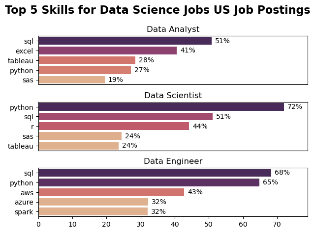

# The Analysis

### 1. What are the most demanded skills for the top 3 most popular Data Jobs?
to find the most demanded skills for the top 3 popular data roles, i first filtered out those positions by which ones were the most popular, and then i got the top 5 skills for each one of the top 3 roles, this query highlights the most popular job titles in data roles with thier associated top skills, showing which skills to pay attention to depending on the role i'm prefering more

 View my notebook with detailed steps here:
 [2_Skills_Count.ipynb](2_Skills_Count.ipynb)

### Visualize Data

```python
fig, ax = plt.subplots(len(top_3_jobs), 1)

for i, job_title in enumerate(top_3_jobs):
    csv_plot = csv_skills_perc[csv_skills_perc['job_title_short'] == job_title].head(5)
    sns.barplot(
        data=csv_plot,
        x='skills_percentage',
        y='job_skills',
        ax=ax[i],
        hue='skills_percentage',
        palette='flare',
        legend=False,
    )
```

### Results


### Insights

- Python is highly sought after in Data Science and Data Engineering roles, appearing in 72% of Data Science job postings and 65% of Data Engineering job postings.
- sql is highly requested in both Data Analyst and Data Engineering roles with over half of job postings.
- Data Engineering require more  specialized technical skills (aws, azure, spark) unlike Data Analyst and Data Science roles who are requiering more general data analyst and management rools such as Excel and Tableau.